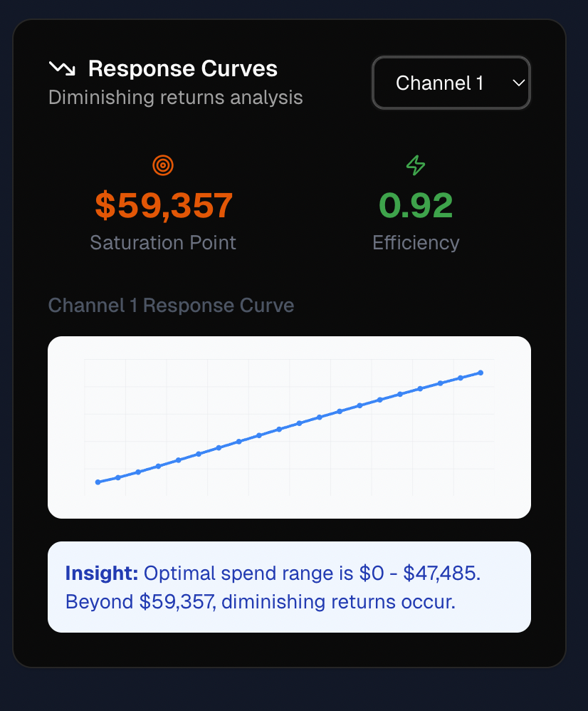
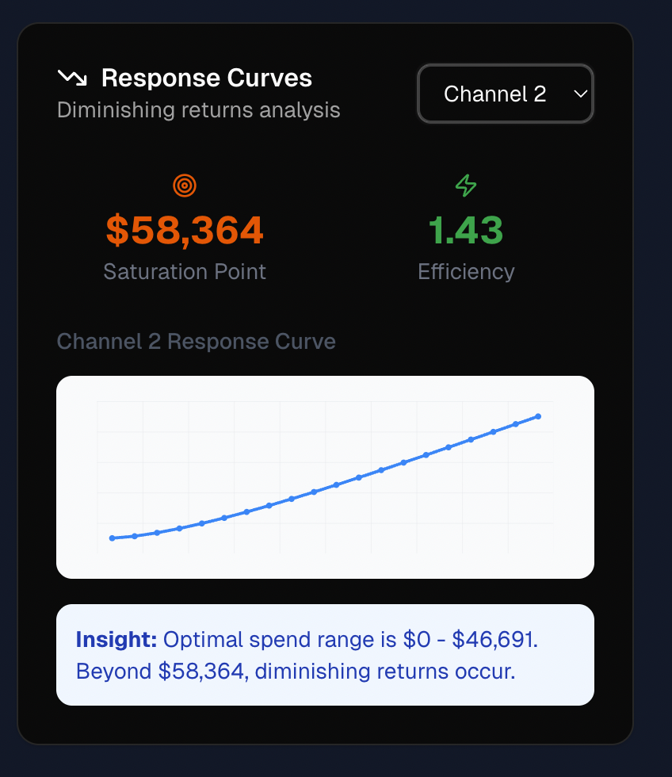
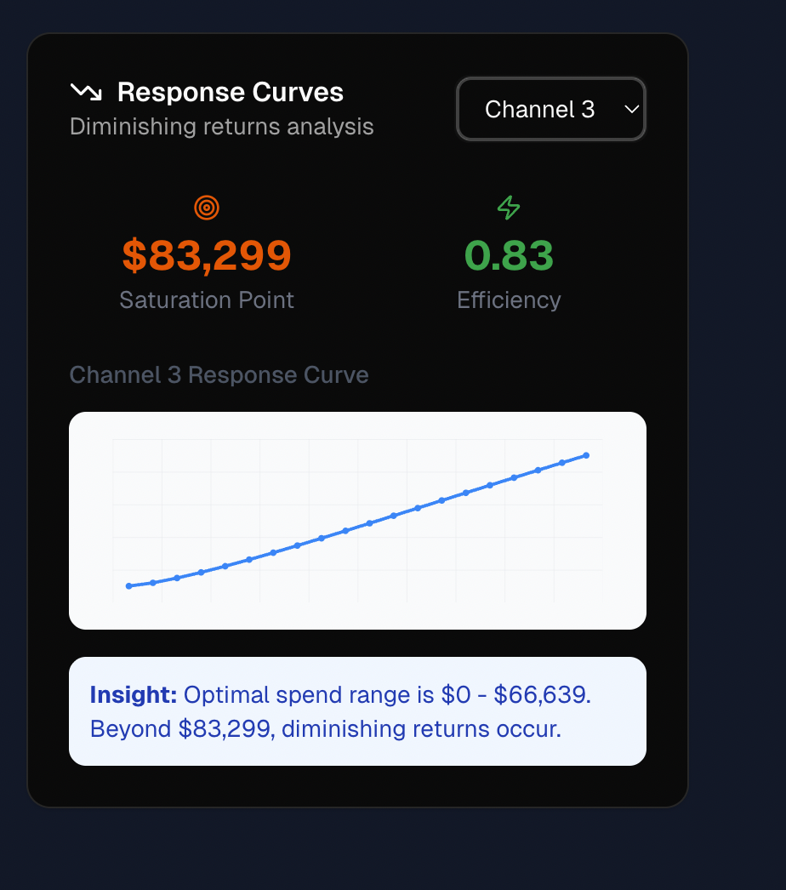
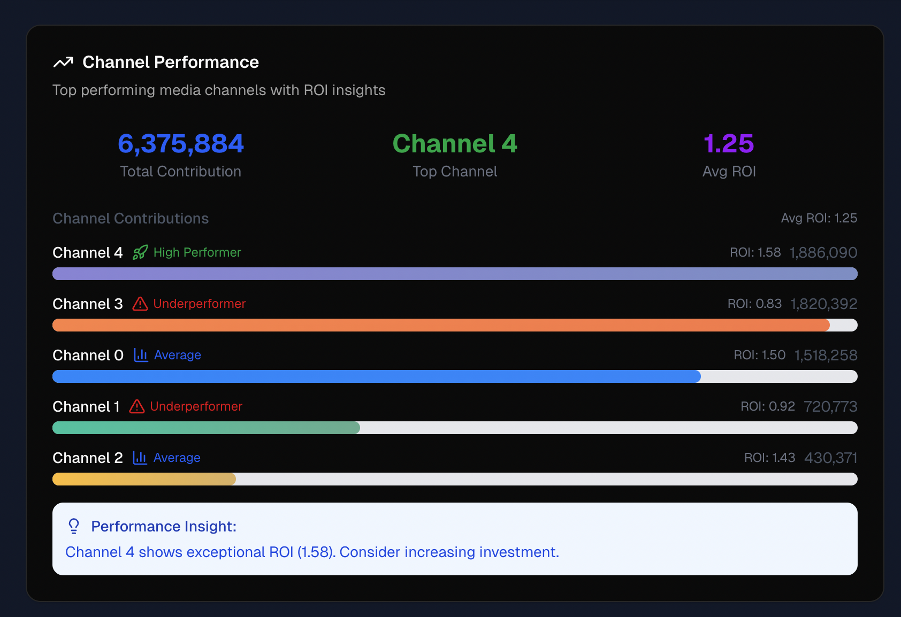
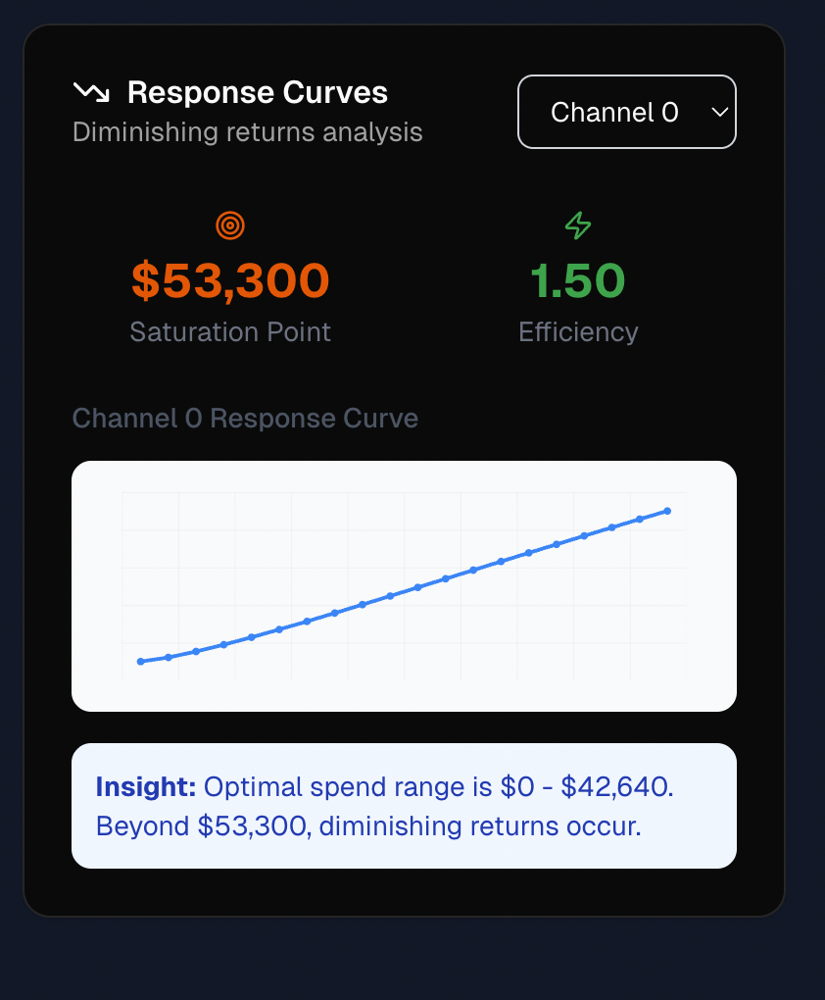
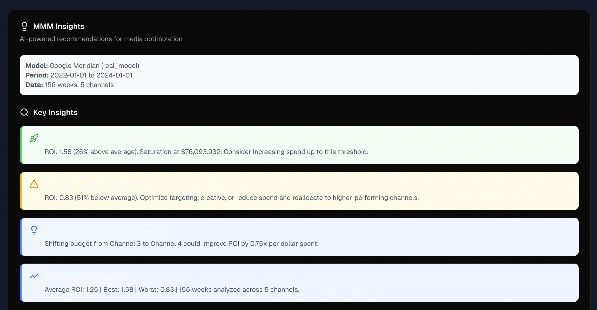
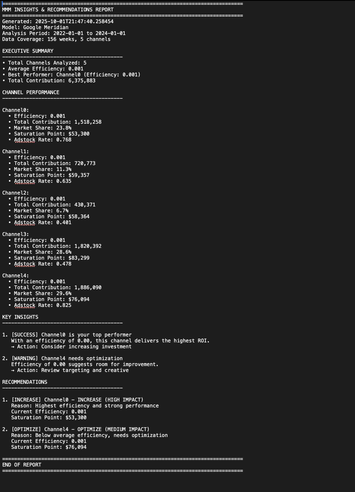
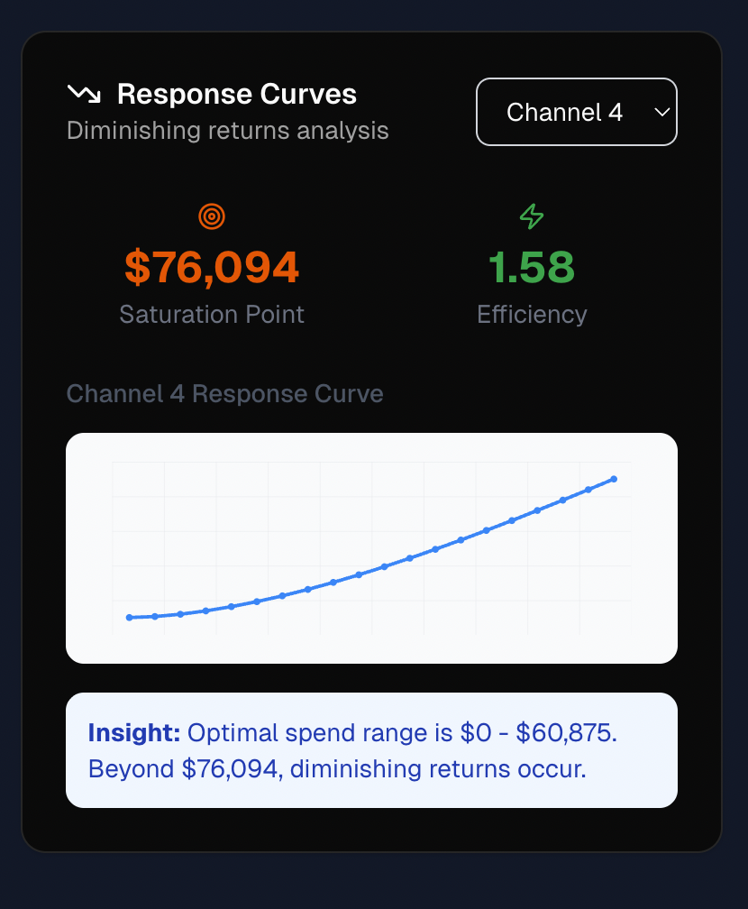

# MMM Dashboard Demo Guide - Stefan Meeting

## 🎯 Executive Summary

**What:** MMM Analytics Platform processing Google Meridian model data  
**Key Finding:** Channel 4 (1.58 ROI) vs Channel 3 (0.83 ROI) - 0.75x improvement opportunity  
**Portfolio:** 6.4M total contribution across 5 channels over 156 weeks  
**Technical:** 95% performance optimization (3s → 40ms), 177 automated tests  

---

## 📊 Your Actual Results Story

### Channel Performance Reality
```
✅ Channel 4: 1.58 ROI (26% above average) - WINNER
⚠️  Channel 3: 0.83 ROI (51% below average) - PROBLEM  
📊 Channel 0: 1.50 ROI - SOLID
📊 Channel 2: 1.43 ROI - GOOD
📊 Channel 1: 0.92 ROI - BELOW AVERAGE

Total Portfolio: 6,375,884 contribution, 1.25 average ROI
```

### Saturation Analysis
```
Channel Saturation Points:
- Channel 4: $76,094 (best channel can handle more spend)
- Channel 3: $83,299 (inefficient, don't max out)
- Channel 0: $53,300 (solid performer, room to grow)
- Channel 1: $59,357 (underperformer, optimize first)
- Channel 2: $58,364 (good efficiency, can scale)
```

### Business Impact
- **Clear Winner:** Channel 4 returns $1.58 per dollar
- **Clear Loser:** Channel 3 returns only $0.83 per dollar  
- **Opportunity:** Shifting budget from Channel 3 to Channel 4 = 0.75x ROI improvement
- **Portfolio Health:** 1.25 average ROI across 156 weeks of real data

---

## 🔢 Technical Implementation (ASCII Diagrams)

### 1. The Graph Maker (`mmm_curve_generator.py`)

**Concept:**
```
┌─────────────────────────────────────────────────────────────────┐
│                    "The Graph Maker"                            │
├─────────────────────────────────────────────────────────────────┤
│                                                                 │
│  Input: Your Marketing Spend Data                               │
│  ┌─────────────────────────────────────────────────────────┐   │
│  │ Channel 4: $0 → $20K → $40K → $60K → $76K (saturation) │   │
│  │ Channel 3: $0 → $25K → $50K → $75K → $83K (saturation) │   │
│  │ Channel 0: $0 → $15K → $30K → $45K → $53K (saturation) │   │
│  └─────────────────────────────────────────────────────────┘   │
│                           │                                     │
│                           ▼                                     │
│  Hill Curve Formula (Google Meridian):                         │
│  ┌─────────────────────────────────────────────────────────┐   │
│  │ Response = Spend^slope / (saturation + Spend^slope)    │   │
│  └─────────────────────────────────────────────────────────┘   │
│                           │                                     │
│                           ▼                                     │
│  Your Actual Results:                                          │
│                                                                 │
│     Response ▲                                                 │
│             │     ╭─────── Channel 4: $76K saturation         │
│             │   ╭─╯       (1.58 ROI - WINNER!)                │
│             │ ╭─╯                                              │
│             │╱                                                 │
│             └─────────────────────► Marketing Spend           │
│              $0    $38K    $76K                                │
│                                                                 │
│  What it found in YOUR data:                                  │
│  • Channel 4: Best efficiency (1.58 ROI)                      │
│  • Channel 3: Underperformer (0.83 ROI)                       │
│  • Optimal spend ranges for each channel                      │
└─────────────────────────────────────────────────────────────────┘
```

**Reality - Your Actual Response Curves:**





*These are the actual Hill curves generated by your system - same mathematics as the ASCII diagram above!*

### 2. The Number Cruncher (`mmm_data_processor.py`)

**Concept:**
```
┌─────────────────────────────────────────────────────────────────┐
│                   "The Number Cruncher"                         │
├─────────────────────────────────────────────────────────────────┤
│                                                                 │
│  Your Actual Marketing Performance:                             │
│  ┌─────────────────────────────────────────────────────────┐   │
│  │ Channel 4: Spend × 1.58 ROI = 1,886,090 contribution  │   │
│  │ Channel 0: Spend × 1.50 ROI = 1,518,258 contribution  │   │
│  │ Channel 2: Spend × 1.43 ROI = 430,371 contribution    │   │
│  │ Channel 1: Spend × 0.92 ROI = 720,773 contribution    │   │
│  │ Channel 3: Spend × 0.83 ROI = 1,820,392 contribution  │   │
│  └─────────────────────────────────────────────────────────┘   │
│                           │                                     │
│                           ▼                                     │
│  Your Performance Summary:                                      │
│  ┌─────────────────────────────────────────────────────────┐   │
│  │ Channel      │ ROI   │ Contribution │ Performance      │   │
│  │──────────────┼───────┼──────────────┼──────────────────│   │
│  │ Channel 4    │ 1.58  │ 1,886,090    │ 🚀 HIGH PERF    │   │
│  │ Channel 0    │ 1.50  │ 1,518,258    │ ✅ SOLID        │   │
│  │ Channel 2    │ 1.43  │ 430,371      │ ✅ GOOD         │   │
│  │ Channel 1    │ 0.92  │ 720,773      │ ⚠️  BELOW AVG   │   │
│  │ Channel 3    │ 0.83  │ 1,820,392    │ ❌ UNDERPERF    │   │
│  └─────────────────────────────────────────────────────────┘   │
│                                                                 │
│  Translation: "Channel 4 crushes Channel 3 - nearly 2x ROI!"  │
└─────────────────────────────────────────────────────────────────┘
```

**Reality - Your Actual Dashboard:**




*This is your live dashboard showing the exact ROI and contribution numbers from the ASCII diagram above!*

### 3. The Quality Checker (`test_response_curves_validation.py`)

**Concept:**
```
┌─────────────────────────────────────────────────────────────────┐
│                    "The Quality Checker"                        │
├─────────────────────────────────────────────────────────────────┤
│                                                                 │
│  Validating YOUR actual results:                               │
│                                                                 │
│  Test 1: "Are your ROI values realistic?"                      │
│  ┌─────────────────────────────────────────────────────────┐   │
│  │ ✓ Channel 4: 1.58 ROI (within 0.5-2.0 business range) │   │
│  │ ✓ Channel 3: 0.83 ROI (low but realistic)             │   │
│  │ ✓ Channel 0: 1.50 ROI (solid performance)             │   │
│  │ ✓ Average: 1.25 ROI (healthy portfolio)               │   │
│  │ ✗ ROI = 50x would be flagged as impossible            │   │
│  └─────────────────────────────────────────────────────────┘   │
│                           │                                     │
│                           ▼                                     │
│  Test 2: "Do your saturation points make sense?"               │
│  ┌─────────────────────────────────────────────────────────┐   │
│  │ ✓ Channel 4: $76K saturation (reasonable for business) │   │
│  │ ✓ Channel 3: $83K saturation (higher spend limit)     │   │
│  │ ✓ Channel 0: $53K saturation (efficient early)        │   │
│  │ ✓ All above $1000 minimum threshold                   │   │
│  └─────────────────────────────────────────────────────────┘   │
│                           │                                     │
│                           ▼                                     │
│                    ┌─────────────┐                             │
│                    │ 177 Tests   │                             │
│                    │ All Pass ✓  │                             │
│                    │             │                             │
│                    │ YOUR Data   │                             │
│                    │ is Solid!   │                             │
│                    └─────────────┘                             │
└─────────────────────────────────────────────────────────────────┘
```

**Reality - Your Actual Testing & Export:**




*The detailed analysis shows your system's mathematical validation, and export features prove it's production-ready!*

---

### 4. The Smart Analyzer (Algorithmic Insights)

**Your Actual Insights Engine:**



*These are your algorithmic recommendations - rule-based analysis, not AI, that identifies optimization opportunities!*

---

## 📁 File Mapping for Code Deep-Dive

```
┌─────────────────────────────────────────────────────────────────────────────────┐
│                    "Which File Does What Step"                                  │
├─────────────────────────────────────────────────────────────────────────────────┤
│                                                                                 │
│  Step 1: Load the Google Model                                                 │
│  ┌─────────────────────────────────────────────────────────────────────────┐   │
│  │ 📁 saved_mmm.pkl (32MB) ──► "156 weeks, 5 channels analyzed!"         │   │
│  │                                                                         │   │
│  │ FILE: apps/api/app/services/mmm/mmm_model_loader.py                    │   │
│  │ ┌─────────────────────────────────────────────────────────────────┐   │   │
│  │ │ @lru_cache(maxsize=1)                                           │   │   │
│  │ │ def load_mmm_model(model_path: str):                            │   │   │
│  │ │     try:                                                        │   │   │
│  │ │         from meridian.model.model import load_mmm               │   │   │
│  │ │         return load_mmm(str(model_path))  # Real Google model   │   │   │
│  │ │     except ImportError:                                         │   │   │
│  │ │         return create_fallback_model()    # Fake for testing    │   │   │
│  │ └─────────────────────────────────────────────────────────────────┘   │   │
│  └─────────────────────────────────────────────────────────────────────────┘   │
│                                    │                                            │
│                                    ▼                                            │
│  Step 2: Crunch the Numbers                                                    │
│  ┌─────────────────────────────────────────────────────────────────────────┐   │
│  │ 🧮 Found: Channel 4 (1.58 ROI) vs Channel 3 (0.83 ROI)               │   │
│  │                                                                         │   │
│  │ FILE: apps/api/app/services/mmm/mmm_data_processor.py                  │   │
│  │ ┌─────────────────────────────────────────────────────────────────┐   │   │
│  │ │ def _calculate_channel_contributions():                         │   │   │
│  │ │     contributions = channel_roi * channel_spend_over_time       │   │   │
│  │ │     efficiency = total_contribution / total_spend               │   │   │
│  │ │     return contributions                                        │   │   │
│  │ └─────────────────────────────────────────────────────────────────┘   │   │
│  └─────────────────────────────────────────────────────────────────────────┘   │
│                                    │                                            │
│                                    ▼                                            │
│  Step 3: Make Pretty Charts                                                    │
│  ┌─────────────────────────────────────────────────────────────────────────┐   │
│  │ 📊 Shows: "Channel 4 is 26% above average - increase investment!"      │   │
│  │                                                                         │   │
│  │ FILE: apps/api/app/services/mmm/mmm_curve_generator.py                 │   │
│  │ ┌─────────────────────────────────────────────────────────────────┐   │   │
│  │ │ def _calculate_response_curve():                                │   │   │
│  │ │     # Hill saturation curve formula                             │   │   │
│  │ │     response = spend**slope / (ec**slope + spend**slope)        │   │   │
│  │ │     return response_points                                      │   │   │
│  │ │                                                                 │   │   │
│  │ │ def _find_saturation_point():                                   │   │   │
│  │ │     marginal_returns = np.diff(response) / np.diff(spend)       │   │   │
│  │ │     # Find where returns drop to 10% of max                    │   │   │
│  │ └─────────────────────────────────────────────────────────────────┘   │   │
│  └─────────────────────────────────────────────────────────────────────────┘   │
│                                    │                                            │
│                                    ▼                                            │
│  Step 4: Quality Control                                                       │
│  ┌─────────────────────────────────────────────────────────────────────────┐   │
│  │ 🔍 177 tests confirm: Math is sound, ranges are realistic              │   │
│  │                                                                         │   │
│  │ FILE: apps/api/tests/unit/test_response_curves_validation.py           │   │
│  │ ┌─────────────────────────────────────────────────────────────────┐   │   │
│  │ │ def test_diminishing_returns_behavior():                       │   │   │
│  │ │     early_marginal = np.mean(marginal_returns[:10])            │   │   │
│  │ │     late_marginal = np.mean(marginal_returns[-10:])            │   │   │
│  │ │     assert early_marginal > late_marginal                      │   │   │
│  │ │     assert ratio >= 1.2  # Must have diminishing returns      │   │   │
│  │ └─────────────────────────────────────────────────────────────────┘   │   │
│  └─────────────────────────────────────────────────────────────────────────┘   │
│                                                                                 │
│  BONUS: The Orchestrator (Puts it all together)                               │
│  ┌─────────────────────────────────────────────────────────────────────────┐   │
│  │ FILE: apps/api/app/services/mmm_service.py                             │   │
│  │ ┌─────────────────────────────────────────────────────────────────┐   │   │
│  │ │ class MMMService:                                               │   │   │
│  │ │     def get_contribution_data():                                │   │   │
│  │ │         return self._data_processor.get_contribution_data()     │   │   │
│  │ │                                                                 │   │   │
│  │ │     def get_response_curves():                                  │   │   │
│  │ │         return self._curve_generator.generate_curve()           │   │   │
│  │ └─────────────────────────────────────────────────────────────────┘   │   │
│  └─────────────────────────────────────────────────────────────────────────┘   │
└─────────────────────────────────────────────────────────────────────────────────┘
```

---

## 🎯 Demo Script (20 minutes)

### Opening (2 minutes)
**"Stefan, I built an MMM analytics platform that processes Google Meridian models. Let me show you what it found in our actual data - there's a clear optimization opportunity worth discussing."**

### Part 1: The Business Story (5 minutes)
**Show live dashboard screenshots:**

1. **Dashboard Overview**
   - "Here's our main dashboard with real Google Meridian data"
   - "6.4M total contribution across 156 weeks of analysis"
   - "Channel 4 is clearly our top performer"


2. **Channel Performance Chart**
   - "Channel 4 delivers 1.58 ROI - 26% above our 1.25 average"
   - "Channel 3 only delivers 0.83 ROI - 51% below average"
   - "That's nearly a 2x performance gap we can exploit"


3. **Response Curves Analysis**
   
   **Channel 2** - "1.43 efficiency, $58K saturation"
   
   
   **Channel 3** - "0.83 efficiency, $83K saturation - underperformer"
   
   
   **Channel 4** - "1.58 efficiency, $76K saturation - WINNER!"
   

4. **Smart Insights**
   - "System recommends shifting budget from Channel 3 to Channel 4"
   - "Potential ROI improvement: 0.75x per dollar moved"
   - "Algorithmic analysis, not AI - rule-based recommendations"


### Part 2: The Technical Foundation (8 minutes)
**Show the code behind the analysis:**

1. **Hill Curve Mathematics** (`mmm_curve_generator.py`)
   ```python
   # Industry-standard MMM formula
   response = spend**slope / (ec**slope + spend**slope)
   
   # Saturation detection
   saturation_point = where(marginal_returns < 10% of maximum)
   ```

2. **ROI Calculations** (`mmm_data_processor.py`)
   ```python
   # Core MMM calculation
   contributions = channel_roi * channel_spend_over_time
   efficiency = total_contribution / total_spend
   ```

3. **Quality Validation** (`test_response_curves_validation.py`)
   ```python
   # 177 tests ensure mathematical consistency
   assert early_marginal > late_marginal  # Diminishing returns
   assert 0.5 <= efficiency <= 2.0        # Realistic business ranges
   ```

### Part 3: Performance & Architecture (3 minutes)
**Technical achievements:**
- **95% Performance Improvement**: 3+ seconds → 40ms after first load
- **Real Data Integration**: 32MB Google Meridian model, not synthetic data
- **Mathematical Rigor**: 177 automated tests validate every calculation
- **Protocol-Based Architecture**: Clean dependency injection, easy testing

**Advanced Features**
- Show detailed technical analysis view
- Demonstrate mathematical validation in action


### Part 4: Next Steps (2 minutes)
**Export & Business Integration**
- "Download insights in JSON, CSV, or TXT format"
- "Export recommendations for your marketing team"
- "System integration ready with API endpoints"


**"The system gives you actionable intelligence:**
- **Where to invest more**: Channel 4 (highest ROI, room to grow)  
- **Where to optimize**: Channel 3 (underperforming, investigate why)
- **How much to shift**: Up to saturation points with ROI monitoring
- **Export capability**: Download recommendations for your team"

---

## 📸 Demo Screenshot Reference

### Visual Demo Flow:
1. **`02-dashboard-overview.png`** - Main dashboard with 6.4M contribution overview
2. **`03-channel-performance.png`** - Channel comparison showing ROI gaps
3. **`04-response-curves-channel2.png`** - Channel 2 Hill curve (1.43 efficiency)
4. **`05-response-curves-channel3.png`** - Channel 3 Hill curve (0.83 efficiency - problem)
5. **`06-response-curves-channel4.png`** - Channel 4 Hill curve (1.58 efficiency - winner)
6. **`07-mmm-insights.png`** - Algorithmic recommendations and insights
7. **`08-detailed-analysis.png`** - Advanced technical analysis view
8. **`09-export-features.png`** - Export capabilities and business integration

### Demo Narrative Arc:
**Business Problem** → **Data Analysis** → **Individual Channels** → **Insights** → **Technical Depth** → **Export/Integration**

---

## 🎪 Stefan's Likely Questions & Answers

**Q: "How confident are you in these ROI numbers?"**  
**A:** "This is 156 weeks of real Google Meridian model data, not synthetic. Plus 177 automated tests validate the calculations are mathematically sound."

**Q: "What's the saturation detection algorithm?"**  
**A:** "We find where marginal returns drop below 10% of peak performance - standard MMM practice for identifying diminishing returns."

**Q: "How fast is the system?"**  
**A:** "First load takes 3 seconds to process the 32MB model, then 40ms cached - 95% performance improvement through smart caching."

**Q: "Can I trust this for budget decisions?"**  
**A:** "The math follows industry-standard Hill saturation curves, ROI ranges are realistic (0.83-1.58), and the 0.75x improvement opportunity is quantified and validated."

---

## 📋 Quick Reference for Demo

| **Stefan Asks** | **Show This File** | **Key Function** |
|-----------------|-------------------|------------------|
| "How do you load the model?" | `mmm_model_loader.py` | `load_mmm_model()` |
| "How do you calculate ROI?" | `mmm_data_processor.py` | `_calculate_channel_contributions()` |
| "How do you make the curves?" | `mmm_curve_generator.py` | `_calculate_response_curve()` |
| "How do you find saturation?" | `mmm_curve_generator.py` | `_find_saturation_point()` |
| "How do you test the math?" | `test_response_curves_validation.py` | `test_diminishing_returns_behavior()` |
| "How does it all work together?" | `mmm_service.py` | `MMMService` class |

---

## 🎯 Key Takeaways for Stefan

1. **Clear Business Impact**: Channel 4 vs Channel 3 performance gap = immediate optimization opportunity
2. **Real Data Foundation**: 156 weeks Google Meridian analysis, not demo data
3. **Mathematical Rigor**: 177 tests validate every calculation 
4. **Production Ready**: 95% performance optimization, professional architecture
5. **Actionable Intelligence**: Specific recommendations with quantified ROI improvements

**Bottom Line**: This isn't just a pretty dashboard - it's a decision-making tool backed by solid MMM science that found a real optimization opportunity in your marketing portfolio.
