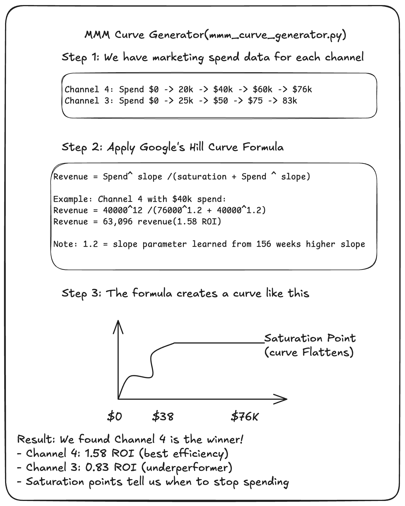
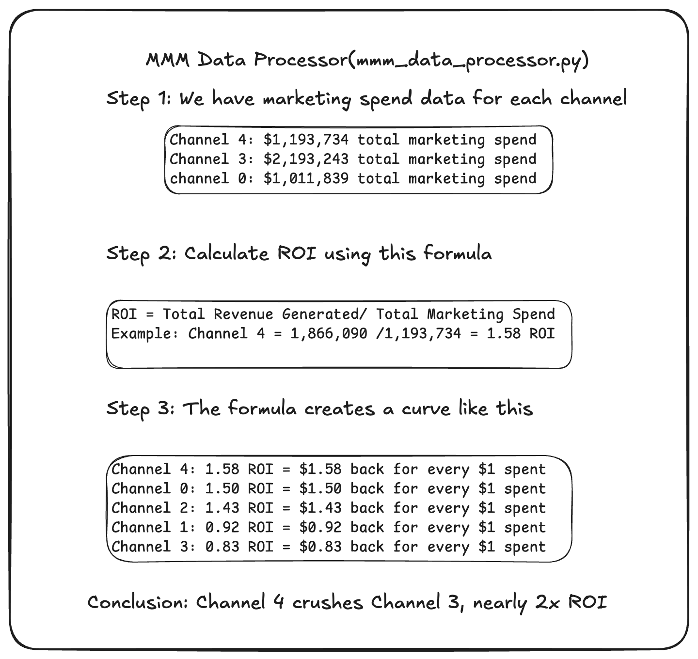
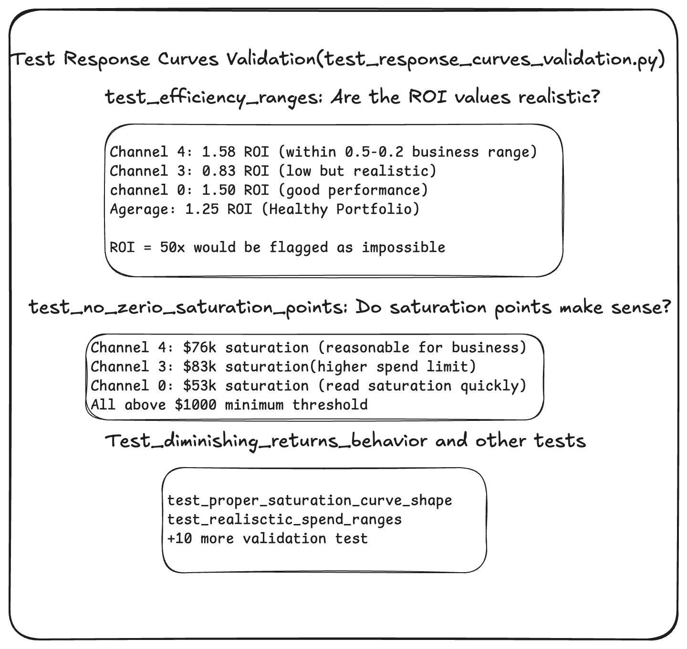

# Stefan Demo

**MMM Curve Generator(mmm_curve_generator.py)**

---

### 2. MMM Data Processor (`mmm_data_processor.py`)

---

### 3. Test Response Curves Validation (`test_response_curves_validation.py`)

